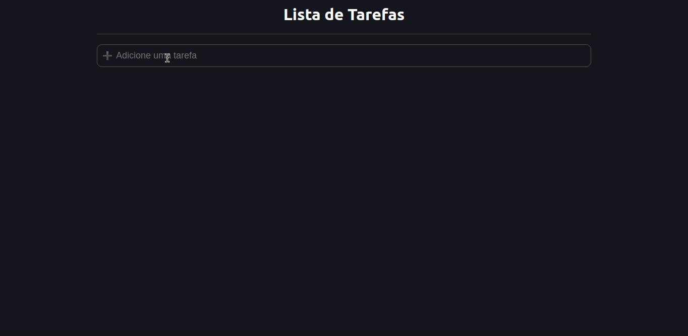

<h1 align="center">
  To.Do React
</h1>

Aplicação de lista listagem de tarefas feito  com ReactJs

  

  
  
  
  
  
  
 

  <a href="#-technologies">Technologies</a>&nbsp;&nbsp;&nbsp;|&nbsp;&nbsp;&nbsp;
  <a href="#-Demonstração">Demonstração</a>&nbsp;&nbsp;&nbsp;|&nbsp;&nbsp;&nbsp;
  <a href="#-license">License</a>

  

## 🚀 Technologies

Technologies that I used to develop this web client

- [ReactJS](https://reactjs.org/)
- [TypeScript](https://www.typescriptlang.org/)
- [Styled Components](https://styled-components.com/)

## 💻 Demonstração

 

## 📝 License

This project is licensed under the MIT License - see the [LICENSE](LICENSE) file for details.

---

Made with 💜 by Gustavo Alves
